# FinHealth Backend — Technical Documentation

## Table of Contents

1. [Overview](#overview)
2. [Architecture](#architecture)
3. [Database Schema](#database-schema)
4. [Authentication Flow](#authentication-flow)
5. [Request Lifecycle](#request-lifecycle)
6. [API Reference](#api-reference)
7. [Services & Business Logic](#services--business-logic)
8. [Subscription & Billing](#subscription--billing)
9. [Security](#security)
10. [Configuration](#configuration)
11. [Testing](#testing)
12. [Deployment](#deployment)

---

## Overview

The backend is an Express.js server written in TypeScript, backed by PostgreSQL (via Prisma ORM). All application procedures are served through **tRPC** at `/trpc`, giving the frontend and mobile app end-to-end type safety with no code generation. Three endpoints remain as plain Express routes where tRPC is unsuitable (token refresh, Stripe webhook, CSV download).

**Tech stack at a glance:**

| Layer | Technology |
|---|---|
| Runtime | Node.js 18+ |
| Framework | Express 4.21 |
| API layer | tRPC 11 |
| Serialization | superjson 1 |
| Language | TypeScript 5.7 |
| Database | PostgreSQL 16 |
| ORM | Prisma 6.4 |
| Auth | JWT + bcrypt + refresh tokens |
| Validation | Zod 3.24 (shared with frontend/mobile) |
| Billing | Stripe 20 |
| Logging | Pino 10 |
| Monitoring | Sentry 10 |
| Testing | Vitest 4 + tRPC caller |

---

## Architecture

### Monorepo Structure

```
fin_health/
├── backend/          ← Express + tRPC server (this document)
├── frontend/         ← React 19 SPA
├── mobile/           ← React Native / Expo
└── packages/
    └── shared/       ← Zod validators + TypeScript types shared across all apps
```

The `AppRouter` type is exported from the backend package (`@fin-health/backend/trpc`) and imported as a **type-only** import by the frontend and mobile. Bundlers strip it at build time — no backend code is ever included in client bundles.

### Backend Layers

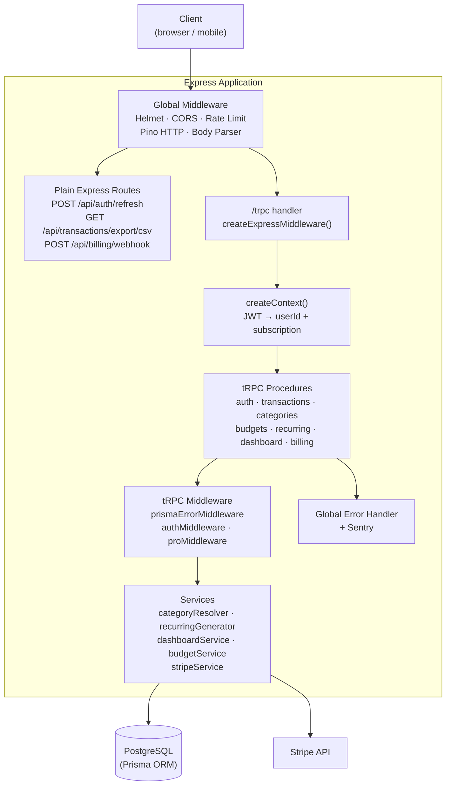

### Directory Map

```
backend/src/
├── index.ts               Server entry point
├── app.ts                 Express setup + tRPC mount + plain Express routes
├── trpc.ts                initTRPC — publicProcedure, protectedProcedure, proProcedure
├── context.ts             createContext — JWT → { userId, subscription }
├── routers/
│   ├── index.ts           Root AppRouter (combines all sub-routers)
│   ├── auth.ts
│   ├── transactions.ts
│   ├── categories.ts
│   ├── budgets.ts
│   ├── recurring.ts
│   ├── dashboard.ts
│   └── billing.ts
├── middleware/
│   ├── auth.ts            Express authMiddleware (used for plain Express routes only)
│   └── errorHandler.ts    Global Express error handler
├── services/
│   ├── categoryResolver.ts
│   ├── recurringGenerator.ts
│   ├── dashboardService.ts
│   ├── budgetService.ts
│   └── stripeService.ts
└── lib/
    ├── prisma.ts          Prisma singleton
    ├── jwt.ts             Token sign / verify
    ├── password.ts        bcrypt helpers
    ├── refreshToken.ts    Refresh token management
    ├── env.ts             Validated environment variables
    ├── logger.ts          Pino instance
    ├── i18n.ts
    └── sentry.ts
```

---

## Database Schema

### Entity Relationship Diagram

```mermaid
erDiagram
    User {
        string id PK
        string email UK
        string password
        string name
        string currency
        datetime passwordChangedAt
        datetime createdAt
        datetime updatedAt
    }

    RefreshToken {
        string id PK
        string token UK
        string userId FK
        datetime expiresAt
        datetime createdAt
    }

    Category {
        string id PK
        string name
        enum type
        string icon
        string color
        string userId FK
        datetime createdAt
        datetime updatedAt
    }

    Subcategory {
        string id PK
        string name
        string categoryId FK
        datetime createdAt
        datetime updatedAt
    }

    Transaction {
        string id PK
        decimal amount
        enum type
        string description
        date date
        string notes
        string categoryId FK
        string subcategoryId FK
        string userId FK
        string recurringTransactionId FK
        datetime deletedAt
        datetime createdAt
        datetime updatedAt
    }

    RecurringTransaction {
        string id PK
        decimal amount
        enum type
        string description
        enum frequency
        date startDate
        date endDate
        boolean isActive
        string notes
        date lastGenerated
        string categoryId FK
        string subcategoryId FK
        string userId FK
        datetime createdAt
        datetime updatedAt
    }

    Budget {
        string id PK
        decimal amount
        int month
        int year
        boolean isRecurring
        string categoryId FK
        string userId FK
        datetime createdAt
        datetime updatedAt
    }

    Subscription {
        string id PK
        string userId FK UK
        enum plan
        enum status
        datetime trialEndsAt
        datetime currentPeriodEnd
        boolean cancelAtPeriodEnd
        string stripeCustomerId
        string stripeSubscriptionId
        datetime createdAt
        datetime updatedAt
    }

    User ||--o{ RefreshToken : "has"
    User ||--o{ Category : "owns"
    User ||--o{ Transaction : "owns"
    User ||--o{ RecurringTransaction : "owns"
    User ||--o{ Budget : "owns"
    User ||--o| Subscription : "has"

    Category ||--o{ Subcategory : "has"
    Category ||--o{ Transaction : "categorises"
    Category ||--o{ RecurringTransaction : "categorises"
    Category ||--o{ Budget : "targets"

    Subcategory ||--o{ Transaction : "categorises"
    Subcategory ||--o{ RecurringTransaction : "categorises"

    RecurringTransaction ||--o{ Transaction : "generates"
```

### Key Design Decisions

- **Soft deletes** — `Transaction.deletedAt` allows recovery and audit; most queries filter `deletedAt IS NULL`.
- **Recurring budgets** — `month=0, year=0, isRecurring=true` is a convention meaning "applies to every month unless overridden by a month-specific row".
- **Auto-created categories** — Categories and subcategories are created on the fly when a transaction names one that doesn't exist yet (`categoryResolver` service).
- **Cascade deletes** — All foreign keys use `onDelete: Cascade`, so deleting a user wipes all their data atomically.

---

## Authentication Flow

### Signup / Login

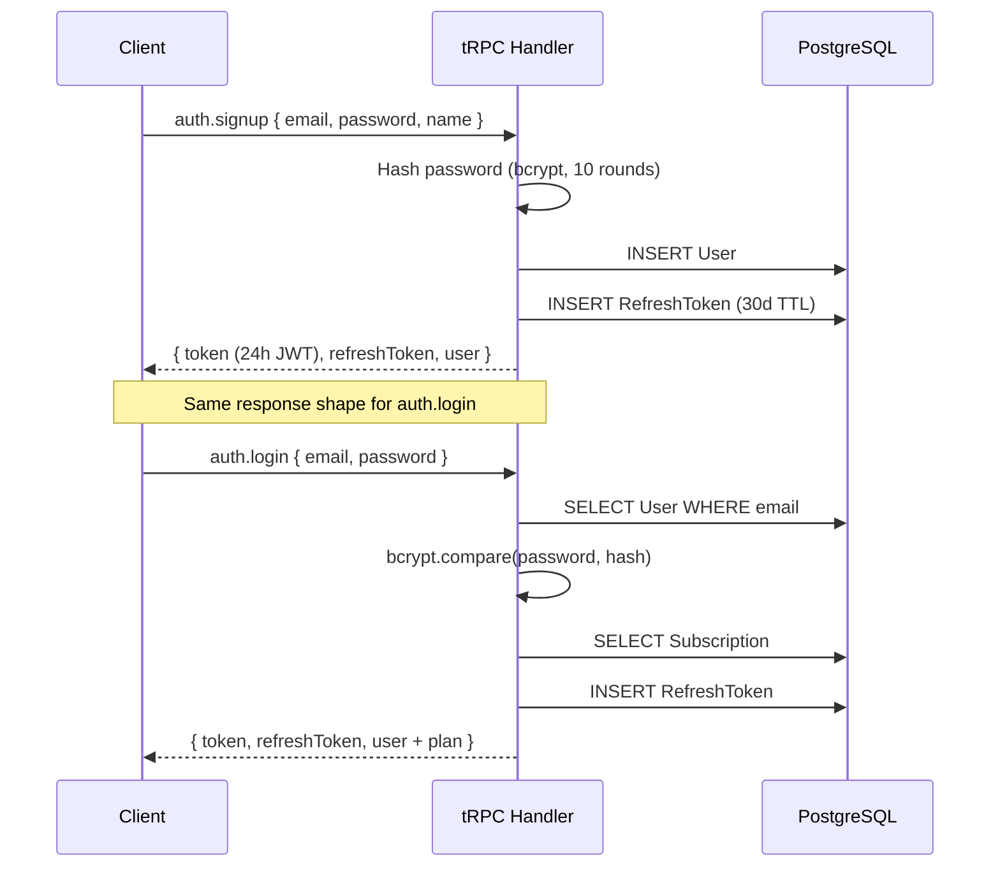

### Token Refresh

The refresh endpoint is a **plain Express route** (`POST /api/auth/refresh`) rather than a tRPC procedure. This breaks the circular dependency that would arise if the client's refresh handler tried to call a tRPC procedure that itself required auth.

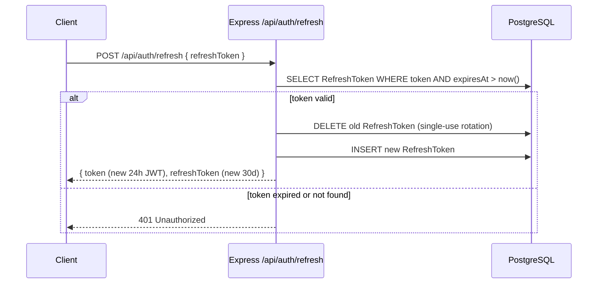

### Password Change

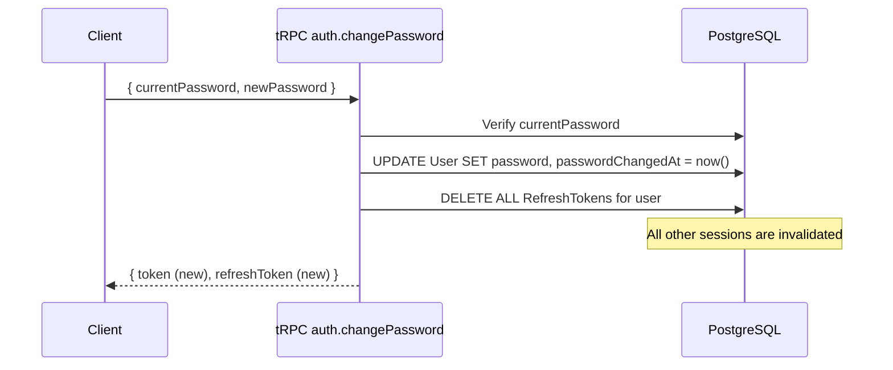

### Context Creation (every tRPC request)

`createContext` runs before every procedure call and populates `{ userId, subscription }` for the procedure chain.

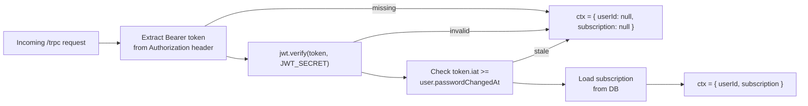

Protected procedures then enforce the auth requirement:

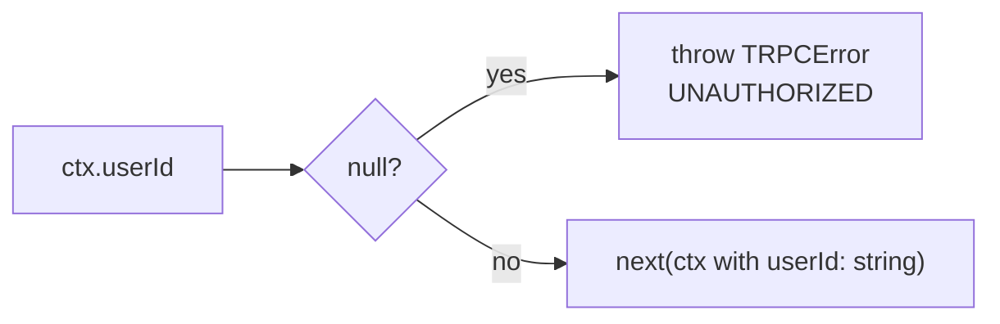

---

## Request Lifecycle

### tRPC procedures (all application logic)

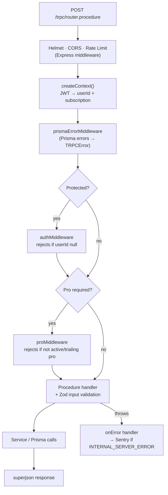

### Plain Express routes (three special cases)

| Route | Reason kept outside tRPC |
|-------|--------------------------|
| `POST /api/auth/refresh` | Called by the client's own refresh handler — can't be tRPC |
| `POST /api/billing/webhook` | Stripe requires raw (unparsed) request body |
| `GET /api/transactions/export/csv` | Streams a CSV file via `pipe()` |

---

## API Reference

All procedures are called via `POST /trpc/<router>.<procedure>` (mutations) or `GET /trpc/<router>.<procedure>` (queries) using the tRPC HTTP protocol. Clients use the typed `@trpc/client` / `@trpc/react-query` SDK — not raw HTTP — so the exact wire format is an implementation detail.

Protected procedures require a valid JWT in the `Authorization: Bearer <token>` header.

### Health

| Method | Path | Auth | Description |
|--------|------|------|-------------|
| GET | `/api/health` | No | Returns `{"status":"ok"}` or 503 if DB unreachable |

---

### Auth (`auth.*`)

Rate-limited to **20 req / 15 min** for `signup` and `login`.

| Procedure | Type | Auth | Description |
|-----------|------|------|-------------|
| `auth.signup` | mutation | No | Register; returns token pair + user |
| `auth.login` | mutation | No | Authenticate; returns token pair + user + plan |
| `auth.me` | query | Yes | Current user profile + subscription |
| `auth.logout` | mutation | Yes | Delete all refresh tokens (global sign-out) |
| `auth.changePassword` | mutation | Yes | Change password; invalidates all sessions; returns new tokens |
| `auth.exportData` | query | Yes | GDPR JSON export of all user data |
| `auth.deleteAccount` | mutation | Yes | Permanently delete account and all data |
| *(plain Express)* `POST /api/auth/refresh` | — | No | Rotate refresh token; returns new token pair |

---

### Transactions (`transactions.*`)

| Procedure | Type | Auth | Description |
|-----------|------|------|-------------|
| `transactions.list` | query | Yes | Paginated list with filters |
| `transactions.byId` | query | Yes | Single transaction |
| `transactions.create` | mutation | Yes | Create; auto-creates category/subcategory |
| `transactions.update` | mutation | Yes | Update |
| `transactions.delete` | mutation | Yes | Soft-delete |
| `transactions.bulkDelete` | mutation | Yes | Soft-delete multiple by ID array |
| *(plain Express)* `GET /api/transactions/export/csv` | — | Yes | CSV download (same filters as `list`) |

**`transactions.list` input:**

| Field | Type | Default | Notes |
|-------|------|---------|-------|
| `page` | number | 1 | |
| `limit` | number | 20 | max 100 |
| `type` | `expense\|income` | — | |
| `categoryId` | string | — | |
| `subcategoryId` | string | — | |
| `startDate` | YYYY-MM-DD | — | |
| `endDate` | YYYY-MM-DD | — | |
| `search` | string | — | Matches description |
| `sortBy` | `date\|amount\|description\|createdAt` | `date` | |
| `sortOrder` | `asc\|desc` | `desc` | |

---

### Categories (`categories.*`)

| Procedure | Type | Auth | Description |
|-----------|------|------|-------------|
| `categories.list` | query | Yes | All categories with subcategories + transaction count |
| `categories.update` | mutation | Yes | Rename, change icon/color |
| `categories.delete` | mutation | Yes | Delete (fails if transactions exist) |
| `categories.merge` | mutation | Yes | Merge into another category (atomic) |
| `categories.listSubcategories` | query | Yes | List subcategories for a category |
| `categories.createSubcategory` | mutation | Yes | Create subcategory |
| `categories.renameSubcategory` | mutation | Yes | Rename subcategory |
| `categories.deleteSubcategory` | mutation | Yes | Delete subcategory (fails if transactions exist) |

---

### Budgets (`budgets.*`)

| Procedure | Type | Auth | Description |
|-----------|------|------|-------------|
| `budgets.list` | query | Yes | Budgets with calculated spent/remaining |
| `budgets.upsert` | mutation | Yes | Create or update budget |
| `budgets.copyPrevious` | mutation | Yes | Copy prior-month budgets to current month |
| `budgets.delete` | mutation | Yes | Delete budget |

---

### Recurring Transactions (`recurring.*`)

| Procedure | Type | Auth | Description |
|-----------|------|------|-------------|
| `recurring.list` | query | Yes | All templates |
| `recurring.byId` | query | Yes | Single template |
| `recurring.create` | mutation | Yes | Create template |
| `recurring.update` | mutation | Yes | Update template |
| `recurring.delete` | mutation | Yes | Delete template |
| `recurring.toggle` | mutation | Yes | Toggle `isActive` |

---

### Dashboard (`dashboard.*`)

| Procedure | Type | Auth | Pro only | Description |
|-----------|------|------|----------|-------------|
| `dashboard.summary` | query | Yes | No | Income, expenses, net, count |
| `dashboard.breakdown` | query | Yes | No | Category % breakdown |
| `dashboard.categoryBreakdown` | query | Yes | No | Nested category + subcategory breakdown |
| `dashboard.yearly` | query | Yes | No | 12-month totals |
| `dashboard.trend` | query | Yes | No | Time-series chart data (default 6, max 24) |
| `dashboard.insights` | query | Yes | **Yes** | Rule-based spending insights |

---

### Billing (`billing.*`)

| Procedure | Type | Auth | Description |
|-----------|------|------|-------------|
| `billing.checkout` | mutation | Yes | Create Stripe Checkout session URL |
| `billing.portal` | query | Yes | Create Stripe Customer Portal URL |
| *(plain Express)* `POST /api/billing/webhook` | — | No* | Stripe webhook (verified via signature) |

---

## Services & Business Logic

### `recurringGenerator`

Runs on every login (non-blocking). For each active `RecurringTransaction` template it calculates which instances are overdue (based on `lastGenerated` or `startDate`) and bulk-inserts them, then updates `lastGenerated`.

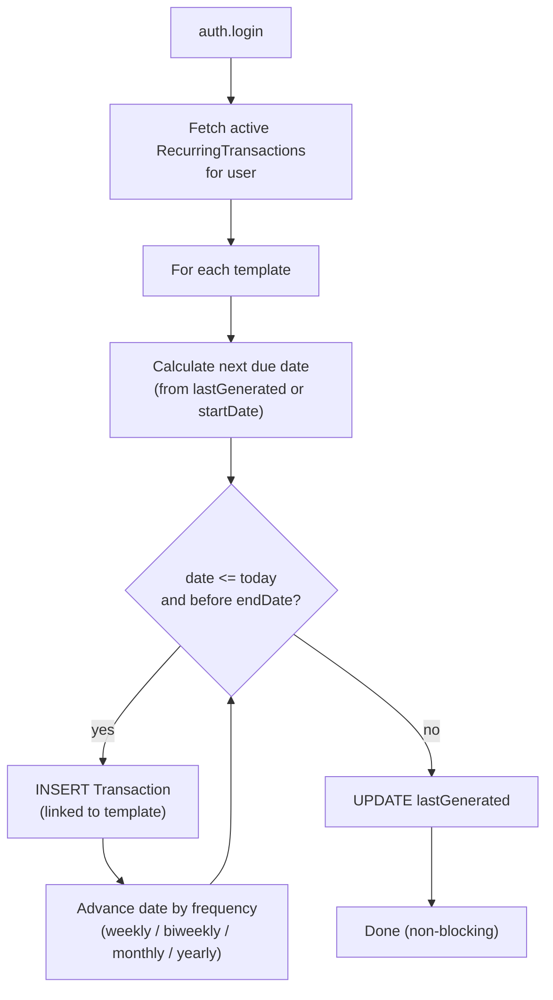

### `categoryResolver`

Called whenever a transaction is created or updated with a `categoryName` string instead of an ID. It finds or creates the category (and optionally subcategory) atomically.

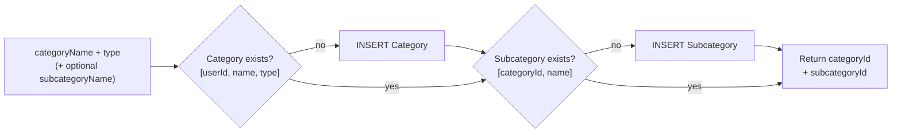

### `budgetService.getBudgetsWithSpent`

Merges two layers of budgets for a given month:

1. **Recurring budgets** (`isRecurring=true`) — act as defaults for every month.
2. **Month-specific budgets** — override the recurring row for that month only.

Then it JOINs actual spending per category to compute `spent` and `remaining`.

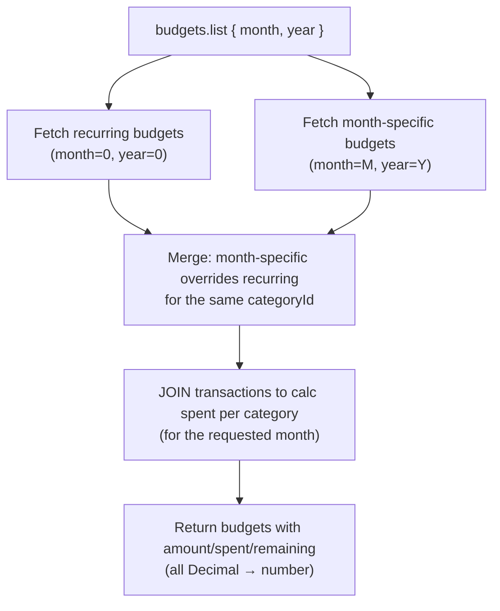

### `dashboardService` — Insights (Pro)

Produces up to 5 rule-based insights for the requested month:

| Insight | Trigger |
|---------|---------|
| Spending pace | On-track vs budget based on days elapsed |
| Over-budget categories | Any category where spent > budget |
| Unusual spending | Category spending >50% above its 3-month rolling average |
| Biggest increase | Category with largest absolute increase vs prior month |
| Biggest decrease | Category with largest absolute decrease vs prior month |

---

## Subscription & Billing

### Plan Tiers

| Feature | Free | Pro |
|---------|------|-----|
| Transactions | Unlimited | Unlimited |
| Budgets | Unlimited | Unlimited |
| Dashboard | Yes | Yes |
| AI Insights | No | **Yes** |

> [!NOTE] See [monetization-plan](./monetization-plan.md) for the full pricing strategy and phased rollout plan.

### Stripe Integration Flow

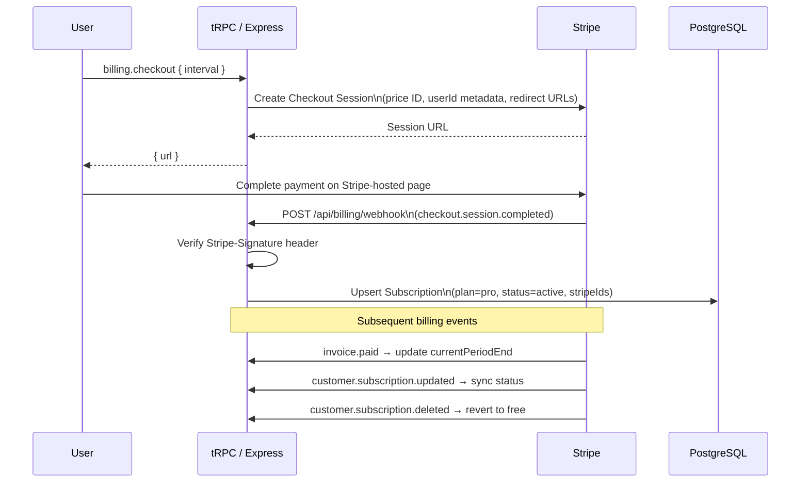

### `proMiddleware` (tRPC)

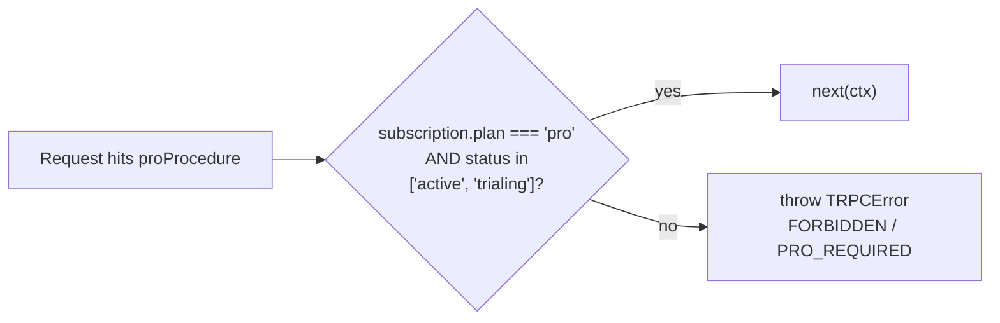

---

## Security

### Defence-in-Depth Summary

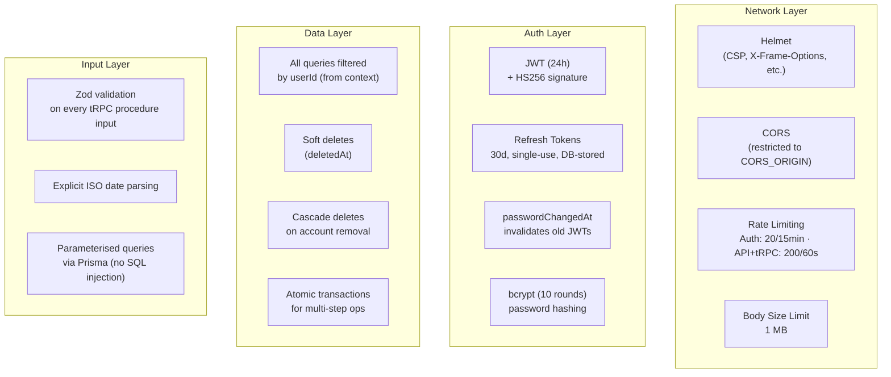

### Stripe Webhook Security

The webhook route (`POST /api/billing/webhook`) is a plain Express route that receives raw bytes. Stripe's SDK verifies the `Stripe-Signature` header against `STRIPE_WEBHOOK_SECRET` before any processing. Requests that fail signature verification are rejected with 400.

---

## Configuration

### Environment Variables

| Variable | Required | Default | Description |
|----------|----------|---------|-------------|
| `DATABASE_URL` | Yes | — | PostgreSQL connection string |
| `JWT_SECRET` | Yes | — | Min 64 chars in production |
| `NODE_ENV` | Yes | — | `development` / `production` / `test` |
| `PORT` | No | `3001` | HTTP listen port |
| `CORS_ORIGIN` | No | `http://localhost:5173` | Allowed client origin |
| `LOG_LEVEL` | No | `info` | Pino level |
| `SENTRY_DSN` | No | — | Error monitoring DSN |
| `STRIPE_SECRET_KEY` | No | — | Stripe secret key |
| `STRIPE_WEBHOOK_SECRET` | No | — | Stripe webhook signing secret |
| `STRIPE_PRO_MONTHLY_PRICE_ID` | No | — | Stripe price ID (monthly plan) |
| `STRIPE_PRO_YEARLY_PRICE_ID` | No | — | Stripe price ID (yearly plan) |
| `CLIENT_URL` | No | `http://localhost:5173` | Used for Stripe redirect URLs |

---

## Testing

Procedures are tested with tRPC's **`createCallerFactory`**, which invokes procedures directly on the server without any HTTP round-trip. This is faster and more expressive than HTTP-level tests. Supertest is kept only for the three plain Express routes (refresh, webhook, CSV export).

### Test Helpers (`test/helpers.ts`)

| Helper | Purpose |
|--------|---------|
| `publicCaller()` | tRPC caller with `{ userId: null, subscription: null }` |
| `callerFor(user)` | tRPC caller with the user's real context (fetches subscription) |
| `createTestUser()` | Inserts a user and returns `{ id, email, token }` |
| `cleanupUser(id)` | Cascade-deletes a user and all related data |
| `api()` | Supertest instance (plain Express routes only) |

### Test Files

| File | Covers |
|------|--------|
| `routes/auth.test.ts` | `auth.*` procedures + token invalidation |
| `routes/transactions.test.ts` | `transactions.*` procedures + CSV export (Supertest) |
| `routes/budgets.test.ts` | `budgets.*` procedures + recurring/override logic |
| `routes/dashboard.test.ts` | `dashboard.*` procedures |
| `routes/billing.test.ts` | `billing.*` procedures + webhook (Supertest) |
| `routes/entitlements.test.ts` | Pro gating, subscription status transitions |

### Running Tests

```bash
cd backend
npm test             # run all tests (requires a running PostgreSQL)
npm run test:watch   # watch mode
```

---

## Deployment

### Docker

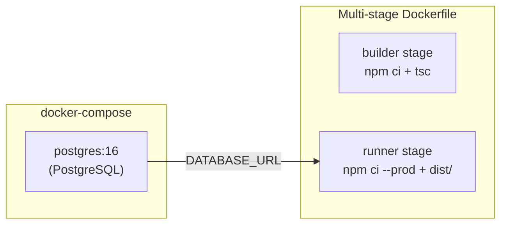

The database is provided by Docker Compose in development. In production, `DATABASE_URL` points to a managed PostgreSQL instance.

### Startup Sequence

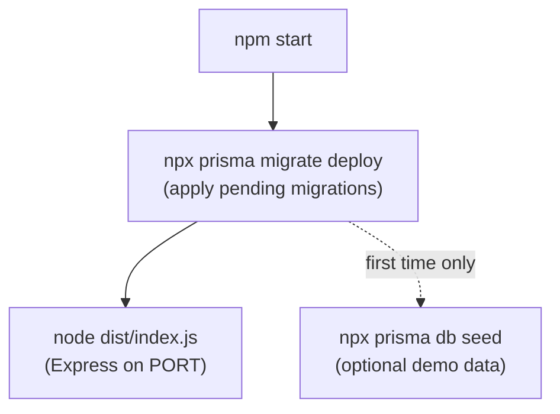

### Health Check

`GET /api/health` runs a lightweight `SELECT 1` via Prisma. Returns `200 {"status":"ok"}` on success or `503 {"status":"unhealthy","error":"..."}` if the database is unreachable. Use this as the liveness/readiness probe in any container orchestrator.

> [!TIP] See [launch-plan](./launch-plan.md) for full deployment steps on Vercel + Railway.
