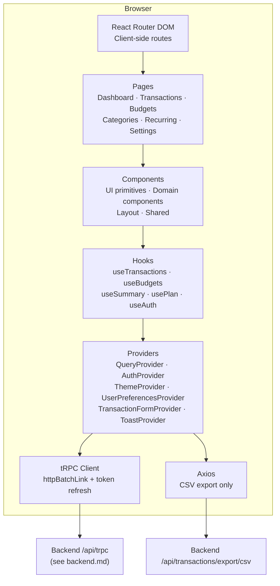
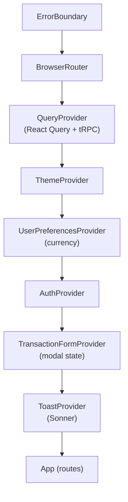
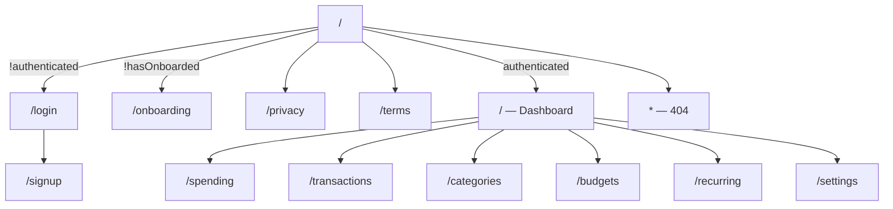
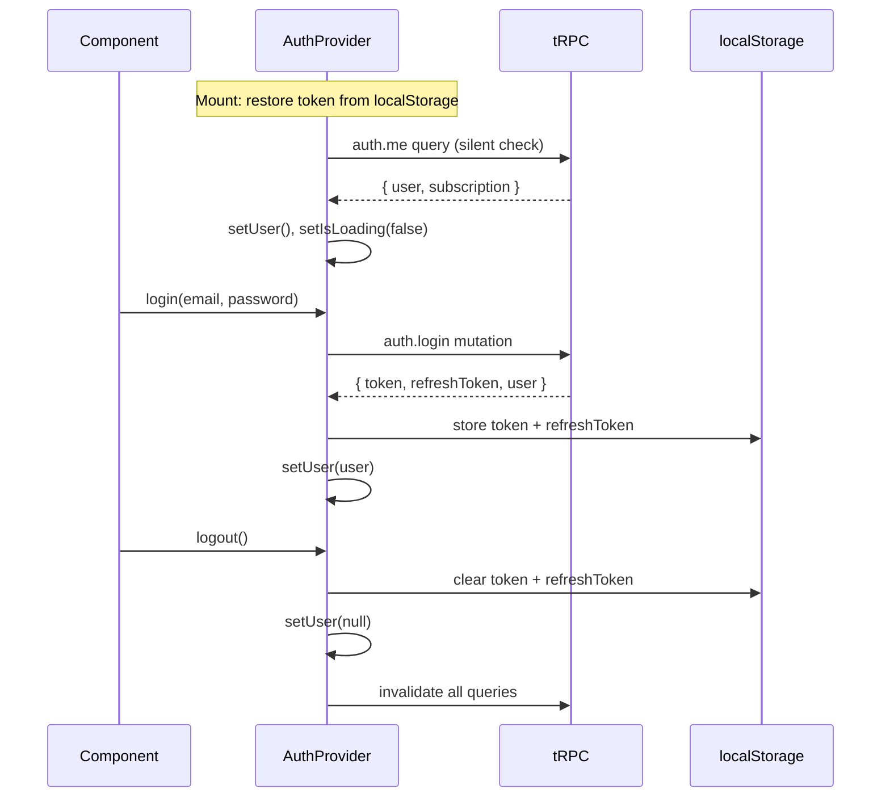
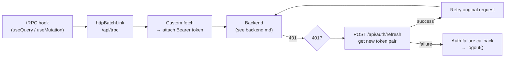
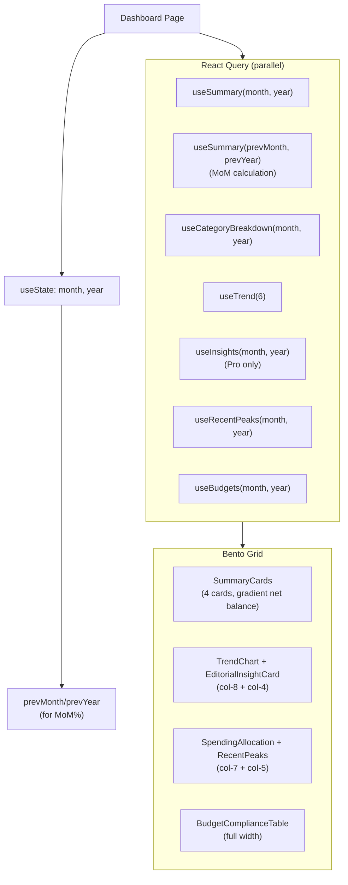

# FinHealth Frontend — Technical Documentation

## Table of Contents

1. [Overview](#overview)
2. [Architecture](#architecture)
3. [Routing](#routing)
4. [State Management](#state-management)
5. [Data Fetching](#data-fetching)
6. [Key Pages](#key-pages)
7. [Components](#components)
8. [Styling](#styling)
9. [Internationalization](#internationalization)
10. [Testing](#testing)
11. [Build & Deployment](#build--deployment)

> [!NOTE] Related: [backend](./backend.md) for the API this app consumes · [mobile](./mobile.md) for the React Native counterpart

---

## Overview

The frontend is a React 19 SPA built with Vite. It communicates exclusively through tRPC (end-to-end type-safe) with one Axios fallback for CSV streaming. All routes are client-side; the server only serves `index.html`.

**Tech stack at a glance:**

| Layer | Technology |
|---|---|
| Runtime | React 19.2 |
| Bundler | Vite 7.3 |
| Routing | React Router DOM 7.13 |
| API layer | tRPC 11 (@trpc/react-query) |
| Server state | TanStack Query 5.90 |
| Forms | React Hook Form 7.71 + Zod 3.25 |
| Styling | Tailwind CSS 4.2 + shadcn/ui (Radix UI) |
| Icons | Lucide React 0.577 |
| Dates | date-fns 4.1 |
| i18n | i18next 25.8 + react-i18next |
| HTTP fallback | Axios 1.13 |
| Notifications | Sonner 2.0 |
| Error tracking | Sentry 10.42 |
| Testing | Vitest 4.0 + Testing Library |
| Linting | Oxlint + Prettier |

---

## Architecture

### Monorepo Position

```
fin_health/
├── backend/          ← API server (see backend.md)
├── frontend/         ← This app
│   ├── src/
│   ├── index.html
│   └── vite.config.ts
├── mobile/           ← React Native app (see mobile.md)
└── packages/shared/  ← Shared Zod types used by all three
```

### Application Layers



### Directory Map

```
frontend/src/
├── main.tsx                  Entry point — providers + Sentry init
├── App.tsx                   Route definitions
├── index.css                 Global styles (Tailwind + custom tokens)
│
├── pages/                    Page-level route components (lazy-loaded)
│   ├── Dashboard.tsx
│   ├── Transactions.tsx
│   ├── Budgets.tsx
│   ├── Spending.tsx
│   ├── Categories.tsx
│   ├── RecurringTransactions.tsx
│   ├── Settings.tsx
│   ├── Login.tsx
│   ├── Signup.tsx
│   ├── Onboarding.tsx
│   ├── Privacy.tsx
│   ├── Terms.tsx
│   └── NotFound.tsx
│
├── components/
│   ├── auth/                 ProtectedRoute
│   ├── dashboard/            SummaryCards, TrendChart, EditorialInsightCard,
│   │                         SpendingAllocation, RecentPeaks, BudgetComplianceTable
│   ├── transactions/         TransactionForm, TransactionList, TransactionFilters,
│   │                         ExportButton
│   ├── budgets/              BudgetCard, BudgetForm, OverallBudget
│   ├── categories/           CategoryList, IconPicker, MergeDialog
│   ├── recurring/            FrequencyBadge
│   ├── spending/             Spending breakdown components
│   ├── layout/               AppLayout, Header, Sidebar, BottomNav,
│   │                         UserMenu, AddTransactionFAB
│   ├── shared/               ErrorBoundary, QueryError, EmptyState,
│   │                         LoadingSkeleton, Pagination, SearchInput, Autocomplete
│   └── ui/                   shadcn/ui primitives (Card, Button, Dialog,
│                             Input, Badge, Tabs, Table, Tooltip, etc.)
│
├── hooks/                    Data + utility hooks
│   ├── useTransactions.ts
│   ├── useCategories.ts
│   ├── useBudgets.ts
│   ├── useRecurring.ts
│   ├── useDashboard.ts       (useSummary, useBreakdown, useTrend, useInsights, useRecentPeaks)
│   ├── usePlan.ts
│   ├── useFormatters.ts
│   ├── useIsMobile.ts
│   └── useDebounce.ts
│
├── providers/
│   ├── QueryProvider.tsx         React Query + tRPC instance
│   ├── TransactionFormProvider.tsx
│   └── ToastProvider.tsx
│
├── contexts/
│   └── UserPreferencesContext.tsx
│
├── lib/
│   ├── auth.tsx              AuthProvider + useAuth hook
│   ├── trpc.ts               tRPC client setup + refresh logic
│   ├── api.ts                Axios instance (CSV only)
│   ├── theme.tsx             ThemeProvider + useTheme
│   ├── i18n.ts               i18next configuration
│   ├── env.ts                Zod-validated env vars
│   ├── utils.ts
│   └── sentry.ts
│
└── locales/
    ├── en.json
    └── pt-BR.json
```

---

## Routing

### Provider Stack (main.tsx)

The order matters — providers are nested innermost-outward:



### Route Map



All authenticated pages are wrapped in `<ProtectedRoute>`, which redirects to `/login` on 401. Pages are **lazy-loaded** via `React.lazy()` with a `<Suspense>` skeleton fallback.

The **onboarding gate** checks `localStorage.getItem('hasOnboarded')` — first-time users are redirected to `/onboarding` regardless of auth state.

---

## State Management

There is no Redux or Zustand. State is split between React Query (server state) and React Context (UI/auth state).

### Auth Context (`lib/auth.tsx`)



**User object shape:**

```typescript
type User = {
  id: string;
  email: string;
  name: string;
  plan: 'free' | 'pro';
  featureFlags: { billing: boolean };
}
```

### Theme Context (`lib/theme.tsx`)

- Preference: `'light' | 'dark' | 'system'`
- Persisted in `localStorage('theme')`
- Applies `dark` class to `document.documentElement`
- Listens to `prefers-color-scheme` media query when preference is `'system'`
- Exported hook: `useTheme()` → `{ theme, setTheme, isDark }`

### User Preferences Context (`contexts/UserPreferencesContext.tsx`)

- Stores the active **currency** (`'USD' | 'BRL'`, others)
- Defaults based on browser locale: `pt-BR` → BRL, all else → USD
- Persisted in `localStorage('currency')`
- Synced to the backend user record on login
- Exported hook: `useUserPreferences()` → `{ currency, setCurrency }`

### Transaction Form Provider (`providers/TransactionFormProvider.tsx`)

Minimal state shared between the FAB button and the modal:

```typescript
type TransactionFormContext = {
  isOpen: boolean;
  openForm: (transaction?: Transaction) => void;
  closeForm: () => void;
}
```

### `usePlan()` Hook

Derives plan state from the auth context. Components should use this instead of reading `user.plan` directly:

```typescript
const { isPro, isFree, canBilling } = usePlan();
```

---

## Data Fetching

### tRPC Client (`lib/trpc.ts`)



**Configuration:**

```typescript
// Batch multiple calls made within the same tick into one HTTP request
httpBatchLink({ url: '/api/trpc', fetch: authenticatedFetch })

// React Query defaults
staleTime: 5 * 60 * 1000   // 5 minutes
retry: 1
```

### Axios Instance (`lib/api.ts`)

Used only for the CSV export endpoint, which streams a file and can't go through tRPC. The interceptor logic is identical to tRPC — Bearer token attachment + 401 refresh.

### Data Hooks Reference

All hooks are thin wrappers around `trpc.<router>.<procedure>.useQuery/useMutation`.

#### Transactions

| Hook | Procedure | Notes |
|------|-----------|-------|
| `useTransactions(filters)` | `transactions.list` | Paginated, returns `{ transactions, pagination }` |
| `useCreateTransaction()` | `transactions.create` | Invalidates transaction + dashboard queries |
| `useUpdateTransaction()` | `transactions.update` | |
| `useDeleteTransaction()` | `transactions.delete` | Soft-delete |
| `useBulkDeleteTransactions()` | `transactions.bulkDelete` | |

#### Budgets

| Hook | Procedure | Notes |
|------|-----------|-------|
| `useBudgets(month, year)` | `budgets.list` | Returns budgets with `spent` and `remaining` pre-calculated |
| `useUpsertBudget()` | `budgets.upsert` | Create or update |
| `useCopyPreviousMonthBudgets()` | `budgets.copyPrevious` | |
| `useDeleteBudget()` | `budgets.delete` | |

#### Categories

| Hook | Procedure | Notes |
|------|-----------|-------|
| `useCategories()` | `categories.list` | Includes subcategories + transaction count |
| `useUpdateCategory()` | `categories.update` | Rename, icon, color |
| `useDeleteCategory()` | `categories.delete` | Fails if transactions exist |
| `useMergeCategory()` | `categories.merge` | Atomic merge |
| `useCreateSubcategory()` | `categories.createSubcategory` | |
| `useRenameSubcategory()` | `categories.renameSubcategory` | |
| `useDeleteSubcategory()` | `categories.deleteSubcategory` | |

#### Dashboard

| Hook | Procedure | Notes |
|------|-----------|-------|
| `useSummary(month, year)` | `dashboard.summary` | Income, expenses, net, count |
| `useBreakdown(month, year)` | `dashboard.breakdown` | Category % breakdown |
| `useCategoryBreakdown(month, year)` | `dashboard.categoryBreakdown` | Nested category + subcategory |
| `useTrend(months)` | `dashboard.trend` | 6-month default; always returns most recent N months |
| `useInsights(month, year)` | `dashboard.insights` | Pro only |
| `useRecentPeaks(month, year)` | `transactions.list` | Fetches top 5 expenses sorted by amount desc |

#### Recurring

| Hook | Procedure | Notes |
|------|-----------|-------|
| `useRecurringTransactions()` | `recurring.list` | |
| `useCreateRecurring()` | `recurring.create` | |
| `useUpdateRecurring()` | `recurring.update` | |
| `useDeleteRecurring()` | `recurring.delete` | |
| `useToggleRecurring()` | `recurring.toggle` | Toggle `isActive` |

---

## Key Pages

### Dashboard (`pages/Dashboard.tsx`)

The most data-intensive page. Fetches 6 queries in parallel; the month selector triggers re-fetches for month-scoped queries while `useTrend` remains constant.



**MoM percentage** is derived client-side:
```typescript
const netChangePercent = useMemo(() => {
  if (!summary || !prevSummary || prevSummary.net === 0) return null;
  return ((summary.net - prevSummary.net) / Math.abs(prevSummary.net)) * 100;
}, [summary, prevSummary]);
```

### Transactions (`pages/Transactions.tsx`)

- Paginated list (20 per page) with `useTransactions(filters)` re-queried on filter change
- Filter panel: type (`income | expense`), category (autocomplete), date range
- Search input (debounced 300ms via `useDebounce`)
- Inline add/edit via the `<TransactionForm>` modal (shared with the FAB)
- **CSV export** via `<ExportButton>` — passes the same filters to Axios for a streamed download
- Bulk delete via row checkboxes

### Budgets (`pages/Budgets.tsx`)

- `useBudgets(month, year)` returns each budget with pre-computed `spent` and `remaining`
- `<OverallBudget>` shows aggregate spending vs. total budget
- Each `<BudgetCard>` shows a progress bar; clicking opens a form to edit
- **Copy previous month** button calls `useCopyPreviousMonthBudgets()`

### Categories (`pages/Categories.tsx`)

- Displays all categories with their subcategories, icon, color, and transaction count
- Inline rename, icon/color picker (`<IconPicker>`)
- **Merge dialog** (`<MergeDialog>`) reassigns all transactions atomically
- Subcategory CRUD within each category row

### Recurring Transactions (`pages/RecurringTransactions.tsx`)

- Lists all recurring templates with `<FrequencyBadge>` chips (weekly, monthly, etc.)
- Toggle active state inline
- Templates are processed by the backend `recurringGenerator` on every login (see [backend — Services & Business Logic](./backend.md#services--business-logic))

---

## Components

### Layout

| Component | Responsibility |
|---|---|
| `AppLayout` | Shell: Sidebar (desktop) + BottomNav (mobile) + main content area |
| `Header` | Top bar with page title, notification/help icons, user menu, glassmorphic background |
| `Sidebar` | Desktop nav with icon + label links |
| `BottomNav` | Mobile 5-tab nav bar |
| `UserMenu` | Avatar dropdown with settings, theme toggle, logout |
| `AddTransactionFAB` | Floating "+" button, calls `openForm()` from `TransactionFormProvider` |

### Shared Utilities

| Component | Responsibility |
|---|---|
| `ProtectedRoute` | Renders children or redirects to `/login` based on `useAuth()` |
| `ErrorBoundary` | Catches React render errors; renders fallback UI + Sentry capture |
| `QueryError` | Shows error message + retry button; receives `onRetry` prop |
| `EmptyState` | Zero-data placeholder with icon + message + optional CTA |
| `LoadingSkeleton` | Animated pulse placeholder (configurable width/height/radius) |
| `Pagination` | Prev/next page controls driven by `{ page, totalPages }` props |
| `SearchInput` | Debounced text input for list filtering |
| `Autocomplete` | Category picker with fuzzy search |

### `ui/` — shadcn/ui Primitives

All components from `components/ui/` are shadcn/ui components styled with Tailwind. They are tree-shaken — only imported components are bundled. Examples: `Button`, `Card`, `Dialog`, `Input`, `Badge`, `Tabs`, `Table`, `Tooltip`, `Select`, `Popover`, `Checkbox`.

---

## Styling

### Tailwind CSS 4.2

Configured via `@tailwindcss/vite` plugin (no separate `tailwind.config.ts` for v4). Custom design tokens are defined as CSS variables in `index.css` using `@theme`:

```css
/* Surface hierarchy (see [Surface Hierarchy](./superpowers/specs/2026-03-23-dashboard-editorial-redesign.md#12-surface-hierarchy)) */
--color-background: hsl(228 33% 97%);
--color-surface-container-low: hsl(228 20% 95%);
--color-surface-container: hsl(228 14% 93%);
--color-card: hsl(0 0% 100%);
--color-surface-bright: hsl(0 0% 100%);
--color-primary-container: hsl(239 82% 66%);

/* Typography */
--font-headline: 'Manrope', system-ui, sans-serif;
--font-body: 'Inter', system-ui, sans-serif;
```

Dark mode values are overridden in `.dark { ... }` inside `@layer base`.

### Dark Mode

Class-based: `document.documentElement.classList.toggle('dark', isDark)`. Components use `dark:` Tailwind variants. The `ThemeProvider` applies the class and listens to `prefers-color-scheme` for the `'system'` preference.

### No-Line Card Rule

`Card` uses tonal lift (white-on-gray background) instead of borders. See [dashboard editorial redesign — No-Line Rule](./superpowers/specs/2026-03-23-dashboard-editorial-redesign.md#13-no-line-rule).

### Typography Pattern

- **Headlines:** `font-headline` (Manrope) — applied to section titles, card amounts
- **Labels/metadata:** `text-[10px] font-bold uppercase tracking-widest` — the "tabloid-chic" look
- **Body:** `font-body` (Inter) — default

### Shadow Philosophy

Primary-tinted shadows instead of generic gray:
- Cards: `shadow-[0_10px_30px_-5px_rgba(70,72,212,0.05)]`
- Floating elements: `shadow-xl shadow-indigo-900/10`

---

## Internationalization

- **Library:** i18next 25.8 + react-i18next
- **Languages:** English (`en`), Brazilian Portuguese (`pt-BR`)
- **Resources:** `src/locales/en.json` and `src/locales/pt-BR.json`

**Setup (`lib/i18n.ts`):**
- Detects browser `navigator.language`
- Falls back to saved `localStorage('language')` preference
- Falls back to `en` if neither matches
- On change, calls `i18n.changeLanguage()` which triggers a re-render of all `useTranslation` hooks

**Usage:**
```tsx
const { t } = useTranslation();
// Simple
t('dashboard.title')
// With interpolation
t('dashboard.greeting', { name: user.name })
// Plurals
t('transactions.count', { count: 42 })
```

**Currency formatting** is handled by `useFormatters()` which reads `useUserPreferences().currency` and returns a `formatCurrency(amount)` function using `Intl.NumberFormat`.

---

## Testing

**Vitest 4.0** replaces Jest (same API, much faster for Vite projects).

### Setup (`src/test/setup.ts`)

- Imports i18n for test locale
- Mocks `localStorage`, `matchMedia`, `IntersectionObserver`
- Cleans up after each test via `afterEach(cleanup)`

### Test Utilities (`src/test/helpers.tsx`)

`renderWithProviders(ui, options)` wraps the component in the full provider stack (QueryClient, Auth, Theme, UserPreferences, TransactionForm, Toast). Tests use this instead of plain `render`.

### Coverage

| Area | Test Files |
|---|---|
| Auth flow | `auth.test.tsx` |
| ProtectedRoute | `ProtectedRoute.test.tsx` |
| Dashboard | `Dashboard.test.tsx` |
| Transactions | `Transactions.test.tsx`, `TransactionForm.test.tsx` |
| Budgets | `Budgets.test.tsx` |
| Categories | `Categories.test.tsx` |
| Dashboard components | `SummaryCards.test.tsx`, `TrendChart.test.tsx`, etc. |

### Running Tests

```bash
cd frontend
npm test             # run all tests
npm run test:watch   # watch mode
npm run test:ui      # Vitest UI browser
npm run coverage     # coverage report
```

---

## Build & Deployment

### Development

```bash
cd frontend
npm run dev          # Vite dev server on http://localhost:5173
```

Vite proxies `/api` → `http://localhost:3001` in dev, so no CORS config is needed locally.

### Production Build

```bash
npm run build        # tsc --noEmit + vite build
npm run preview      # preview the production build locally
```

**Manual chunk splitting** in `vite.config.ts`:
```typescript
manualChunks: {
  'react': ['react', 'react-dom', 'react-router-dom'],
  'charts': ['recharts'],
}
```

Source maps are generated but hidden (`sourcemap: 'hidden'`) — they are uploaded to Sentry but not served publicly.

### Environment Variables

| Variable | Required | Description |
|---|---|---|
| `VITE_API_URL` | Yes (prod) | Backend URL (e.g. `https://api.yourdomain.com`) |
| `VITE_SENTRY_DSN` | No | Error tracking |
| `SENTRY_ORG` | No (build) | For source map upload |
| `SENTRY_PROJECT` | No (build) | For source map upload |
| `SENTRY_AUTH_TOKEN` | No (build) | For source map upload |

### Deployment Target: Vercel

See [launch-plan — Web Hosting](./launch-plan.md) for full deployment steps.

- Connect repo → target `frontend/` workspace
- Build command: `npm run build -w @fin-health/frontend`
- Output directory: `frontend/dist`
- Set `VITE_API_URL` environment variable to Railway backend URL
