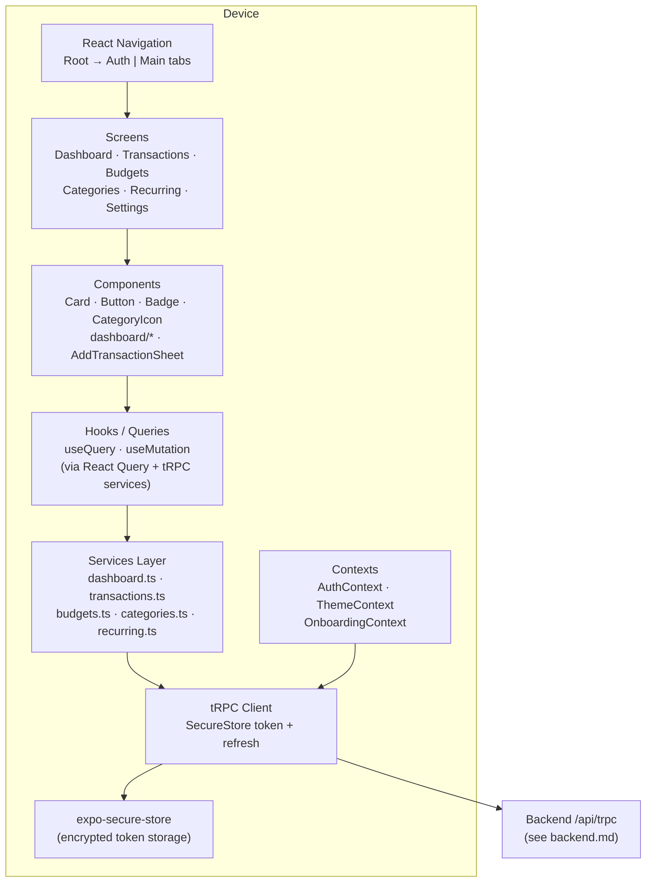
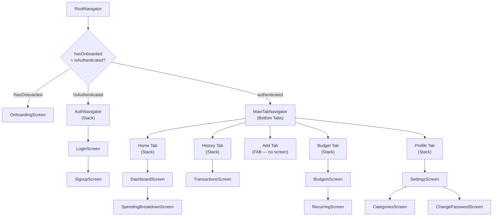
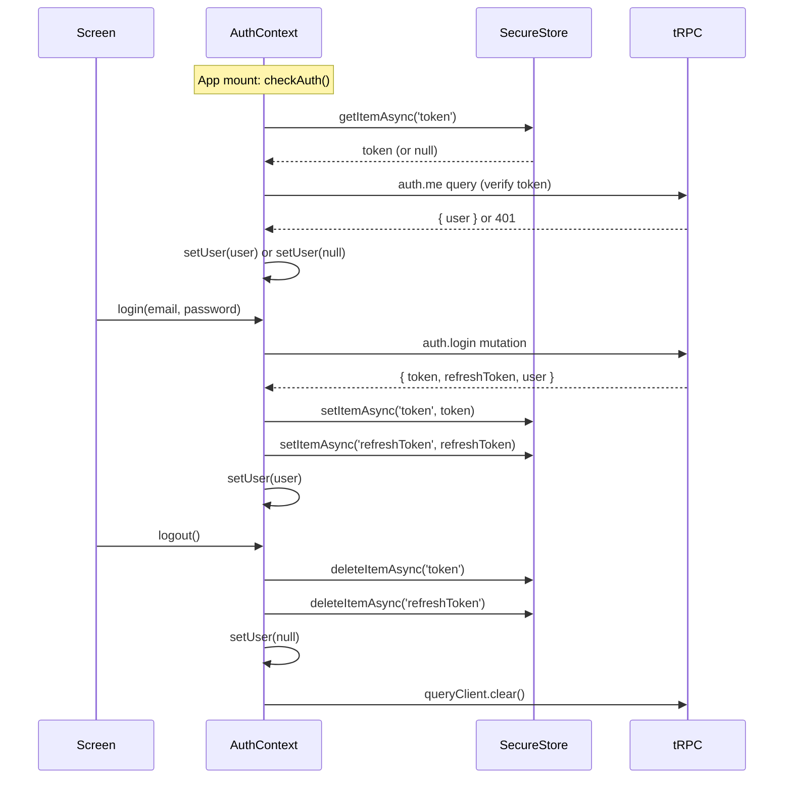
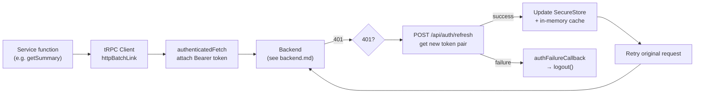
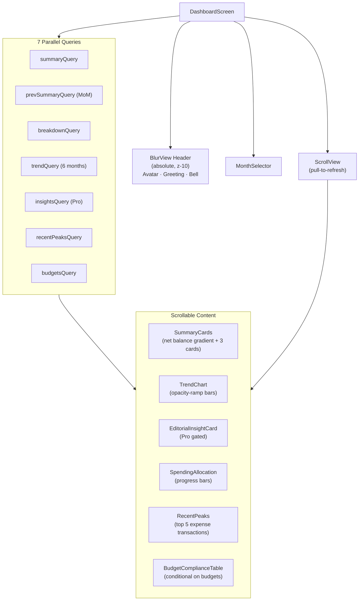
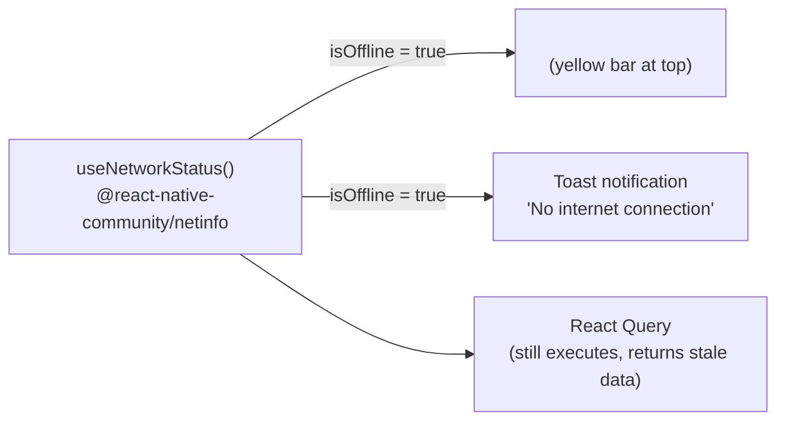

# FinHealth Mobile — Technical Documentation

## Table of Contents

1. [Overview](#overview)
2. [Architecture](#architecture)
3. [Navigation](#navigation)
4. [State Management](#state-management)
5. [Data Fetching](#data-fetching)
6. [Key Screens](#key-screens)
7. [Components](#components)
8. [Theme & Styling](#theme--styling)
9. [Internationalization](#internationalization)
10. [Offline Support](#offline-support)
11. [Testing](#testing)
12. [Build & Deployment](#build--deployment)

> [!NOTE] Related: [backend](./backend.md) for the API this app consumes · [frontend](./frontend.md) for the React web counterpart

---

## Overview

The mobile app is a React Native / Expo managed-workflow app. It shares the same tRPC backend and Zod types as the frontend. Navigation uses React Navigation (tabs + stacks), and tokens are stored in the device's encrypted keychain via `expo-secure-store`.

**Tech stack at a glance:**

| Layer | Technology |
|---|---|
| Runtime | React 19.2 + React Native 0.85 |
| Platform | Expo SDK 56 (managed workflow) |
| Navigation | React Navigation 7 (bottom tabs + native stacks) |
| API layer | tRPC 11 (@trpc/client — direct calls, not hooks) |
| Server state | TanStack Query 5.62 |
| Forms | React Hook Form 7.54 + Zod 3.24 |
| Token storage | expo-secure-store (iOS Keychain / Android Keystore) |
| Icons | Lucide React Native 0.468 |
| Fonts | @expo-google-fonts/manrope + @expo-google-fonts/inter |
| Dates | date-fns |
| i18n | i18next 25.8 + react-i18next |
| Offline detection | @react-native-community/netinfo |
| Bottom sheet | @gorhom/bottom-sheet |
| Notifications | react-native-toast-message |
| Haptics | expo-haptics |
| Blur | expo-blur |
| Error tracking | @sentry/react-native |
| Testing | Jest (jest-expo) + @testing-library/react-native |

---

## Architecture

### Monorepo Position

```
fin_health/
├── backend/          ← API server (see backend.md)
├── frontend/         ← React web app (see frontend.md)
├── mobile/           ← This app
│   ├── src/
│   ├── App.tsx
│   └── index.js
└── packages/shared/  ← Shared Zod types
```

### Application Layers



### Directory Map

```
mobile/
├── index.js                  Entry point (expo-router/entry)
├── App.tsx                   App root — providers + font loading + Sentry
│
└── src/
    ├── contexts/
    │   ├── AuthContext.tsx    User auth state + login/logout
    │   ├── ThemeContext.tsx   Light/dark theme + color palette
    │   └── OnboardingContext.tsx
    │
    ├── navigation/
    │   ├── RootNavigator.tsx     Root: checks onboarding + auth → routes
    │   ├── AuthNavigator.tsx     Unauthenticated: Login → Signup
    │   ├── MainTabNavigator.tsx  5-tab bottom nav + nested stacks
    │   └── types.ts              Navigation param types
    │
    ├── screens/
    │   ├── DashboardScreen.tsx
    │   ├── SpendingBreakdownScreen.tsx
    │   ├── TransactionsScreen.tsx
    │   ├── BudgetsScreen.tsx
    │   ├── RecurringScreen.tsx
    │   ├── CategoriesScreen.tsx
    │   ├── SettingsScreen.tsx
    │   ├── ChangePasswordScreen.tsx
    │   ├── LoginScreen.tsx
    │   ├── SignupScreen.tsx
    │   └── OnboardingScreen.tsx
    │
    ├── components/
    │   ├── Card.tsx, Button.tsx, Badge.tsx, Input.tsx
    │   ├── CategoryIcon.tsx, CurrencyInput.tsx, MonthSelector.tsx
    │   ├── ProgressBar.tsx, SegmentedControl.tsx, ProGate.tsx
    │   ├── AddTransactionSheet.tsx  (bottom sheet modal)
    │   ├── EmptyState.tsx, LoadingSkeleton.tsx, QueryError.tsx
    │   ├── OfflineBanner.tsx, ErrorBoundary.tsx
    │   └── dashboard/
    │       ├── SummaryCards.tsx
    │       ├── TrendChart.tsx
    │       ├── EditorialInsightCard.tsx
    │       ├── SpendingAllocation.tsx
    │       ├── RecentPeaks.tsx
    │       └── BudgetComplianceTable.tsx
    │
    ├── services/               tRPC call wrappers
    │   ├── api.ts              SecureStore + in-memory token cache
    │   ├── auth.ts
    │   ├── dashboard.ts        getSummary, getBreakdown, getTrend, getInsights, getRecentPeaks
    │   ├── budgets.ts
    │   ├── transactions.ts
    │   ├── categories.ts
    │   └── recurring.ts
    │
    ├── hooks/
    │   ├── useNetworkStatus.ts
    │   ├── useFormatters.ts
    │   └── usePlan.ts
    │
    ├── lib/
    │   ├── trpc.ts             tRPC client + authenticatedFetch + refresh
    │   ├── env.ts              Zod-validated EXPO_PUBLIC_* vars
    │   └── i18n.ts             i18next setup
    │
    ├── constants/
    │   ├── theme.ts            Color palettes, spacing, typography, FontFamily
    │   └── icons.ts            Category icon name → Lucide icon mapping
    │
    ├── types/
    │   └── dashboard.ts        DashboardSummary, BreakdownItem, TrendItem
    │
    └── locales/
        ├── en.json
        └── pt-BR.json
```

---

## Navigation

### Structure Overview



### Tab Bar Details

The center tab (`AddPlaceholder`) is a visual slot with no screen. Pressing it triggers `openTransactionSheet()` via context, opening `<AddTransactionSheet>` (a `@gorhom/bottom-sheet`).

The tab bar uses custom icons from Lucide React Native and theme colors from `ThemeContext`.

### Navigation Type Safety

`navigation/types.ts` defines param types for every stack:

```typescript
type RootStackParamList = {
  Onboarding: undefined;
  Auth: undefined;
  Main: undefined;
};

type HomeStackParamList = {
  Dashboard: undefined;
  SpendingBreakdown: { month: number; year: number };
};
// etc.
```

Components use typed hooks: `useNavigation<NavigationProp<HomeStackParamList>>()`.

---

## State Management

### Auth Context (`contexts/AuthContext.tsx`)



**User object shape:**

```typescript
type User = {
  id: string;
  name: string;
  email: string;
  currency: string;
  plan: 'free' | 'pro';
  featureFlags: { billing: boolean };
}
```

**Token storage difference from web:** The mobile app uses `expo-secure-store` (iOS Keychain / Android Keystore) instead of `localStorage`. This provides hardware-backed encryption for tokens.

### Theme Context (`contexts/ThemeContext.tsx`)

- Preference stored in `AsyncStorage('theme')`
- Resolved to actual `'light' | 'dark'` via `useColorScheme()` when preference is `'system'`
- Exposes the active color palette: `const { colors, isDark } = useTheme()`
- All theme-aware components destructure `colors` from this hook

### `usePlan()` Hook

Same pattern as frontend — derives plan state from `AuthContext`:

```typescript
const { isPro, isFree, canBilling } = usePlan();
```

Used by `<ProGate>` component and `EditorialInsightCard` to gate Pro features.

---

## Data Fetching

### Key Difference from Frontend

The mobile app uses tRPC's **procedural client** (`createTRPCClient`) rather than tRPC React Query hooks. Components use React Query's `useQuery` / `useMutation` directly, calling service functions that wrap the tRPC client:

```typescript
// services/dashboard.ts
export async function getSummary(month: number, year: number) {
  const { data } = await trpc.dashboard.summary.query({ month, year });
  return data;
}

// In a screen:
const summaryQuery = useQuery({
  queryKey: ['dashboard', 'summary', month, year],
  queryFn: () => getSummary(month, year),
});
```

This separation makes services independently testable and keeps screens clean.

### tRPC Client (`lib/trpc.ts`)



The tRPC client holds an **in-memory token cache** (`cachedToken`) for performance — avoids SecureStore reads on every request. On app resume or token refresh, the cache is updated.

### Services Reference

| Service | Key Functions |
|---|---|
| `dashboard.ts` | `getSummary`, `getBreakdown`, `getTrend`, `getInsights`, `getRecentPeaks` |
| `transactions.ts` | `getTransactions`, `createTransaction`, `updateTransaction`, `deleteTransaction`, `bulkDeleteTransactions` |
| `budgets.ts` | `getBudgets`, `createBudget`, `updateBudget`, `deleteBudget`, `copyPreviousMonthBudgets` |
| `categories.ts` | `getCategories`, `updateCategory`, `deleteCategory`, `mergeCategories`, `createSubcategory`, etc. |
| `recurring.ts` | `getRecurring`, `createRecurring`, `updateRecurring`, `deleteRecurring`, `toggleRecurring` |
| `auth.ts` | `changePassword` |

---

## Key Screens

### DashboardScreen

The most complex screen. See [mobile dashboard editorial redesign spec](./superpowers/specs/2026-03-23-mobile-dashboard-editorial-redesign.md) for the full design spec and [mobile dashboard editorial redesign plan](./superpowers/plans/2026-03-23-mobile-dashboard-editorial-redesign.md) for the implementation plan.



**Layout note:** The `BlurView` header is `position: 'absolute'` and floats over the `ScrollView`. The scroll content has `paddingTop` equal to the header height so content is not hidden beneath it.

### TransactionsScreen

- `useInfiniteQuery` for paginated loading (load-more on scroll)
- Transactions grouped by date with section headers ("Today", "Yesterday", "Mon 3 Mar", etc.)
- Swipe gesture / long-press to delete
- Tap row to edit → opens `<AddTransactionSheet>` pre-filled
- **Pull-to-refresh** resets and re-fetches from page 1
- Filter bar: type toggle (`income | expense`), category picker

### BudgetsScreen

- Month selector at top (same `<MonthSelector>` component as Dashboard)
- `<ProgressBar>` per category showing spent / budget
- Color changes to red when `spent > budget`
- **Copy previous month** FAB in bottom-right
- Tap budget → edit form in a bottom sheet

### SettingsScreen

- Theme selector (Light / Dark / System)
- Language selector (English / Português)
- Account section: name, email (read-only), change password
- Currency selector (synced to backend via tRPC `auth.me` update)
- Sign out button (calls `logout()`)
- Billing: links to subscription management (conditionally shown via `usePlan().canBilling`)

---

## Components

### Design System Components

| Component | Props | Notes |
|---|---|---|
| `Card` | `{ children, style? }` | Borderless, elevation/shadow from theme (no-line rule) |
| `Button` | `{ title, onPress, variant?, loading? }` | Primary / secondary / ghost variants |
| `Badge` | `{ label, color? }` | Pill badge for status labels |
| `Input` | `{ label, error, ...TextInputProps }` | Controlled input with label + error message |
| `CurrencyInput` | `{ value, onChangeValue, currency }` | Numeric input with currency symbol |
| `ProgressBar` | `{ progress, color? }` | 0–1 progress bar |
| `SegmentedControl` | `{ options, selected, onSelect }` | iOS-style segmented control (income/expense toggle) |

### Domain Components

| Component | Props | Notes |
|---|---|---|
| `CategoryIcon` | `{ icon?, color?, size? }` | Lucide icon in colored circle; null-safe with gray fallback |
| `MonthSelector` | `{ selectedMonth, selectedYear, onSelect }` | Month/year stepper |
| `AddTransactionSheet` | (no props — reads context) | `@gorhom/bottom-sheet` for create/edit transaction |
| `ProGate` | `{ children, fallback? }` | Renders children if pro; fallback (upgrade prompt) otherwise |
| `OfflineBanner` | (no props) | Yellow banner shown when `useNetworkStatus().isOffline` |

### Dashboard Components

All live in `components/dashboard/`. See [mobile dashboard editorial redesign spec](./superpowers/specs/2026-03-23-mobile-dashboard-editorial-redesign.md) for detailed specs.

| Component | Responsibility |
|---|---|
| `SummaryCards` | Gradient net balance card + 3 half-width summary cards |
| `TrendChart` | Opacity-ramp bar chart (6 months) |
| `EditorialInsightCard` | Dark indigo AI insights card with Pro gate |
| `SpendingAllocation` | Horizontal progress-bar category breakdown |
| `RecentPeaks` | Top 5 expenses transaction list with skeleton states |
| `BudgetComplianceTable` | Budget vs. actual with on-track / over-budget badges |

---

## Theme & Styling

### Color System (`constants/theme.ts`)

Two complete palettes — `lightTheme` and `darkTheme` — with identical keys:

| Token | Light | Dark | Purpose |
|---|---|---|---|
| `primary` | `#6366f1` (indigo-500) | `#818cf8` | Brand, buttons, icons |
| `primaryContainer` | `hsl(239,82%,66%)` | `hsl(239,82%,60%)` | Gradient endpoint (net balance card) |
| `background` | `hsl(220,14%,96%)` | `#0f1729` | Page background |
| `card` | `#ffffff` | `hsl(222,47%,11%)` | Card background |
| `surfaceBright` | `#ffffff` | `hsl(222,47%,14%)` | Elevated card (dark mode only) |
| `surfaceContainerLow` | `hsl(228,20%,95%)` | `hsl(217,33%,12%)` | Progress bar tracks |
| `surfaceContainer` | `hsl(228,14%,93%)` | `hsl(217,33%,17%)` | Divider replacement |
| `text` | `#1a1a2e` | `#e2e8f0` | Primary text |
| `textSecondary` | `#64748b` | `#94a3b8` | Muted / label text |
| `income` | `#16a34a` | `#22c55e` | Income amounts, on-track badges |
| `expense` | `#dc2626` | `#f87171` | Expense amounts, over-budget badges |
| `incomeBg` | `#dcfce7` | `rgba(34,197,94,0.15)` | Income badge background |
| `expenseBg` | `#fee2e2` | `rgba(248,113,113,0.15)` | Expense badge background |

### Spacing & Size Constants

```typescript
export const Spacing = { xs: 4, sm: 8, md: 12, lg: 16, xl: 20, xxl: 24, xxxl: 32 };
export const BorderRadius = { sm: 8, md: 12, lg: 16, full: 9999 };
export const FontSize = { caption: 12, body: 14, sectionHeader: 18, pageTitle: 24, display: 32 };
```

### Typography (`FontFamily`)

```typescript
export const FontFamily = {
  headline: 'Manrope_700Bold',
  headlineSemiBold: 'Manrope_600SemiBold',
  body: 'Inter_400Regular',
  bodyMedium: 'Inter_500Medium',
  bodySemiBold: 'Inter_600SemiBold',
  bodyBold: 'Inter_700Bold',
} as const;
```

Fonts are loaded in `App.tsx` via `useFonts()` from `@expo-google-fonts`. The app renders `null` until fonts resolve (splash screen stays visible during load).

### Category Colors (`constants/theme.ts`)

10 named color pairs, each with `icon` (icon color) and `bg` (background circle color):

```typescript
export const CategoryColors = {
  orange:  { icon: '#f97316', bg: '#fff7ed' },
  blue:    { icon: '#3b82f6', bg: '#eff6ff' },
  purple:  { icon: '#a855f7', bg: '#faf5ff' },
  // ... emerald, amber, red, cyan, teal, indigo, pink
}
```

`CategoryIcon` uses this map to render the correct colors based on the category's `color` string field.

### No-Line Card Rule

`Card` component: no `borderWidth`. Light mode uses `shadowColor: colors.primary` + `shadowOpacity: 0.06`. Dark mode uses `surfaceBright` background for tonal separation (RN shadows don't render well on dark backgrounds). See [mobile spec — Card No-Line Rule](./superpowers/specs/2026-03-23-mobile-dashboard-editorial-redesign.md#3-foundation-card-no-line-rule).

---

## Internationalization

- **Library:** i18next 25.8 + react-i18next
- **Languages:** English (`en`), Brazilian Portuguese (`pt-BR`)
- **Resources:** `src/locales/en.json` and `src/locales/pt-BR.json`

**Setup (`lib/i18n.ts`):**
- Detects `Intl.DateTimeFormat().resolvedOptions().locale`
- Persists selected language in `AsyncStorage('language')`
- Falls back to `en`

**Usage:** identical to frontend — `const { t } = useTranslation()`.

**Currency formatting** is handled by `useFormatters()` which reads the user's `currency` field from `AuthContext` and returns a `formatCurrency(amount)` function using `Intl.NumberFormat`.

---

## Offline Support



There is no manual offline-first caching (no IndexedDB equivalent). React Query's default stale/cache behavior serves the last successful response. Mutations queue up and fail — the user sees a toast error.

> [!NOTE] Full offline-first support (optimistic mutations, background sync) is a potential future enhancement.

---

## Testing

**Jest** with the `jest-expo` preset (handles Metro bundler transforms, Expo-specific modules).

### Setup (`jest.setup.ts`)

- Mocks `@react-native-async-storage/async-storage`
- Mocks `expo-secure-store`
- Mocks `@react-native-community/netinfo`
- Mocks all Lucide icons → `<View testID="icon-{Name}" />` (avoids SVG rendering issues in JSDOM)
- Mocks `@expo-google-fonts` → returns `[true]` from `useFonts` immediately
- Mocks `expo-blur` → renders `<View testID="blur-view" />`

### Test Utilities (`src/__tests__/test-utils.tsx`)

`renderWithTheme(ui)` wraps in `ThemeProvider` + `QueryClientProvider`. Most component tests use this.

### Coverage

| Area | Test Files |
|---|---|
| Auth flow | `AuthContext.test.tsx` |
| Dashboard components | `SummaryCards.test.tsx`, `TrendChart.test.tsx`, `EditorialInsightCard.test.tsx`, `SpendingAllocation.test.tsx`, `RecentPeaks.test.tsx`, `BudgetComplianceTable.test.tsx` |
| Services | `dashboard.test.ts` (getRecentPeaks) |
| Screens | `DashboardScreen.test.tsx` (smoke), `TransactionsScreen.test.tsx` |

### Running Tests

```bash
cd mobile
npx jest                          # run all tests
npx jest --watch                  # watch mode
npx jest src/__tests__/path/to/test.tsx  # single file
npx jest --coverage               # coverage report
```

---

## Build & Deployment

### Development

```bash
cd mobile
npx expo start            # Metro bundler + Expo dev tools
npx expo start --ios      # Open iOS simulator
npx expo start --android  # Open Android emulator
```

Set `EXPO_PUBLIC_API_URL=http://localhost:3001` (or your local machine IP for physical devices).

### EAS Build (Production)

```bash
npm install -g eas-cli
eas build:configure            # generates eas.json
eas build --platform ios --profile production
eas build --platform android --profile production
```

Set the API URL as an EAS secret:
```bash
eas secret:create --scope project --name EXPO_PUBLIC_API_URL --value https://api.yourdomain.com
```

### App Submission

```bash
eas submit --platform ios
eas submit --platform android
```

### Environment Variables

| Variable | Required | Description |
|---|---|---|
| `EXPO_PUBLIC_API_URL` | Yes | Backend URL |
| `EXPO_PUBLIC_ENV` | No | `development` / `staging` / `production` |
| `EXPO_PUBLIC_SENTRY_DSN` | No | Error tracking |

### Deployment Target: App Store + Google Play

See [launch-plan — Mobile App Stores](./launch-plan.md) for full submission steps including `bundleIdentifier`, `package` name, store listing requirements, and EAS secrets setup.

### app.json Key Fields

Before first EAS build, verify in `mobile/app.json`:
- `ios.bundleIdentifier` — must match App Store Connect registration
- `android.package` — must match Google Play Console registration
- `version` and `ios.buildNumber` / `android.versionCode` — increment on each release
